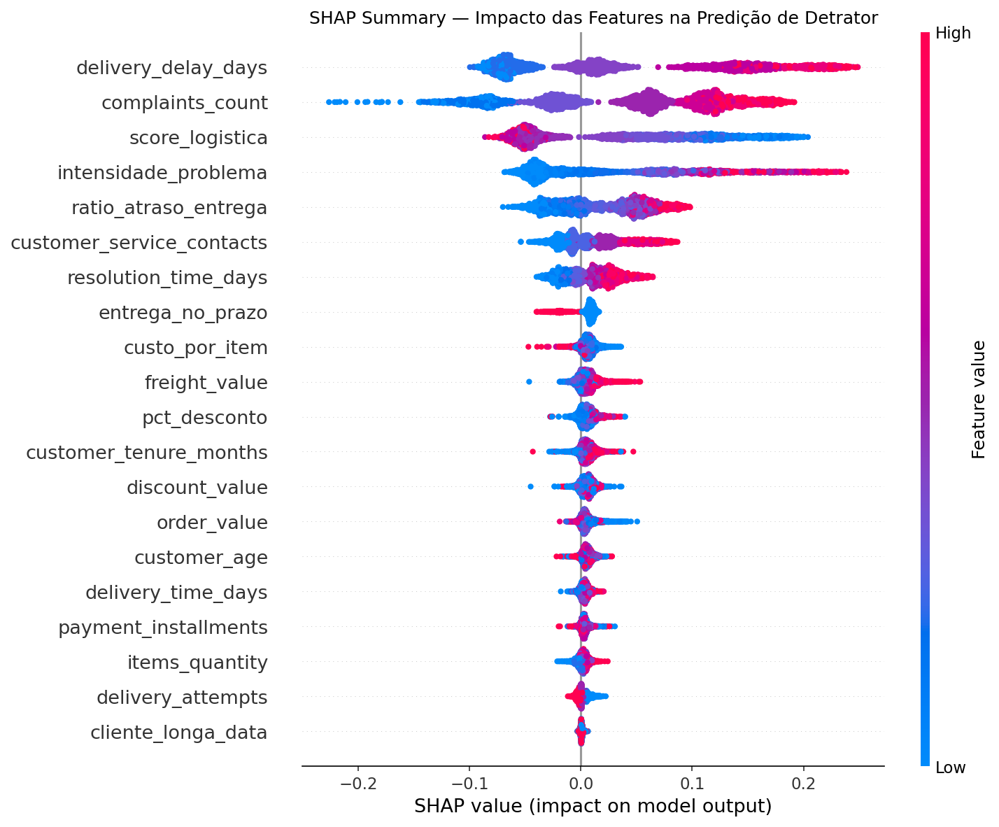
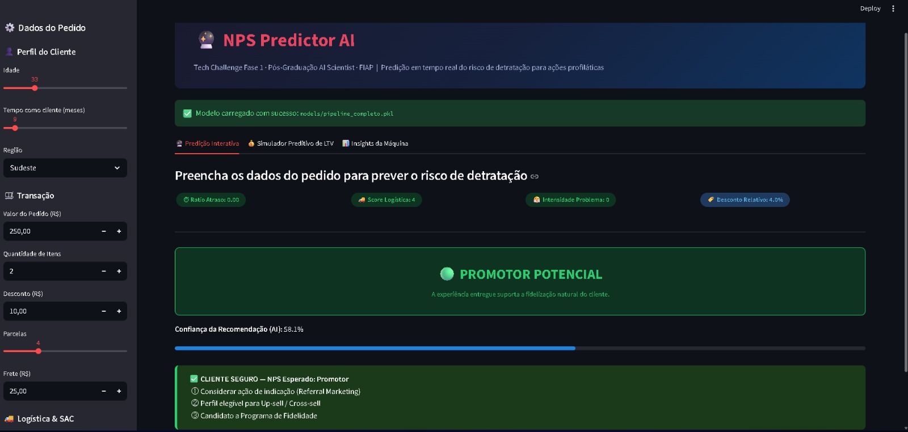
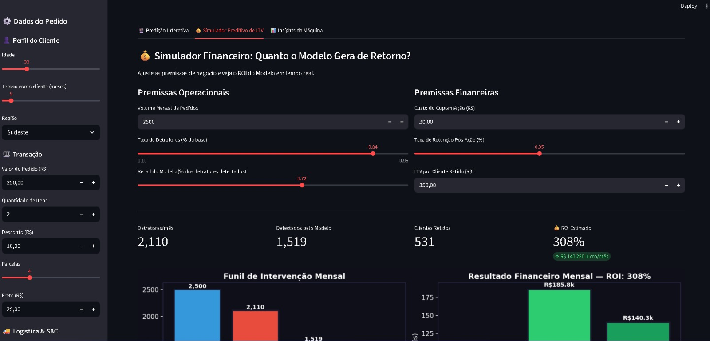
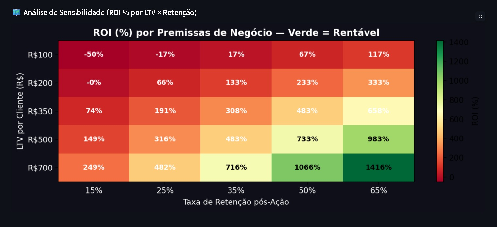
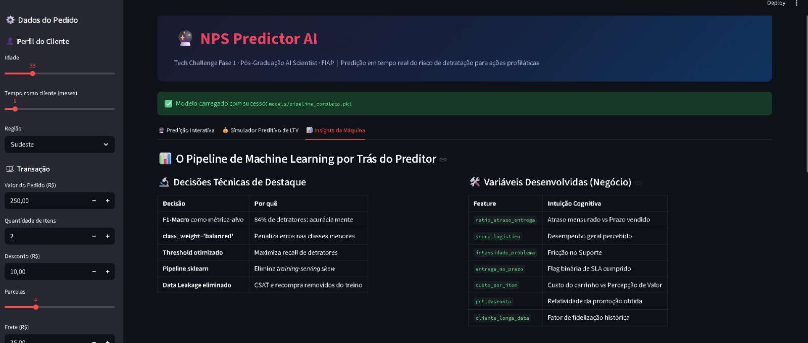
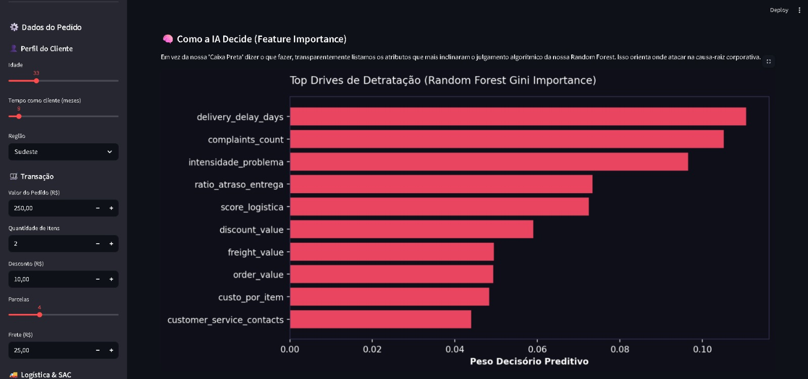

# NPS Predictor AI: Tech Challenge Fase 1


[](https://www.python.org/)
[](https://scikit-learn.org/)
[](https://streamlit.io/)
[](#)
[](#)
[](#)

> **O Foco deste Projeto: Explorar e Traduzir Dados em Estratégia.** Este projeto nasceu com foco em modelagem avançada e MLOps, mas foi **recalibrado** para destacar o que realmente importa na Fase 1: o entendimento do problema de negócio através de **Análise Exploratória de Dados (EDA)**, storytelling executivo e a tradução técnica para impacto financeiro. A modelagem atua como um forte complemento analítico, e não como o eixo principal.

> **Atualização (setembro/2026):** o projeto passou por uma **refatoração completa** de engenharia — benchmark real de modelos, testes de unidade, explicabilidade (SHAP), monitor de drift real, threshold calibrado por custo. Ver [§ 9](#9-refatoração-completa-setembro2026) para o resumo e `docs/wayfinder/tech_challenge_nps/` para o registro de cada decisão técnica.

---

## Índice

1. [O Problema de Negócio](#1-o-problema-de-negócio)
2. [O Que Torna Esse Projeto Diferente](#2-o-que-torna-esse-projeto-diferente)
3. [A Jornada dos Dados: CRISP-DM](#3-a-jornada-executiva-dos-dados-highlights-do-diagnóstico)
4. [Modelo Final e Explicabilidade](#4-modelo-final-e-explicabilidade)
5. [ROI Financeiro: De F1-Score a Dinheiro Real](#5-roi-financeiro--de-f1-score-a-dinheiro-real)
6. [Deploy: Streamlit App](#6-deploy-streamlit-app)
7. [Estrutura do Repositório](#7-estrutura-do-repositório)
8. [Como Reproduzir](#8-como-reproduzir)
9. [Refatoração Completa (Setembro/2026)](#9-refatoração-completa-setembro2026)

---

## 1. O Problema de Negócio

Um e-commerce nacional em forte expansão passou a enfrentar uma crise sistêmica de experiência: o **NPS médio desabou para 4.38/10**, com **74,04% dos clientes classificados como Detratores** (classificação NPS clássica: nota 0–6).

A empresa só coletava o NPS **depois** do encerramento da jornada de compra, quando o dano já estava feito. Nossa missão: construir um sistema preditivo capaz de **antecipar a detratação** com base em dados operacionais, disparando ações profiláticas antes da pesquisa.

> *"Quais fatores operacionais destroem a satisfação do cliente, e como prever isso antes do cliente responder?"*

---

## 2. O Que Torna Esse Projeto Diferente

A maioria dos projetos de ML em cursos entrega um modelo treinado e uma acurácia. Este projeto vai além em dimensões críticas que o diferenciam:

### 1. Data Leakage: Detectado, Eliminado e Medido Empiricamente

Variáveis aparentemente poderosas (`csat_internal_score`, `repeat_purchase_30d`) foram identificadas como **variáveis futuras**: elas só existem após a experiência do cliente, não no momento da predição.

**Impacto medido empiricamente (CV 5-fold, não estimativa):**
```
F1-Score SEM leakage (correto, modelo em produção): 0.5687
F1-Score COM leakage (errado, apenas para demonstração): 0.7886
Ganho ARTIFICIAL: +0.22 pontos (não existe em produção)
```
> Um modelo com leakage quebraria completamente no go-live. Identificar isso — e medir o tamanho exato da ilusão — é o que separa um cientista de dados de um "ajustador de parâmetros".

### 2. A Armadilha da Acurácia em Dados Desbalanceados

Com 74% de Detratores, um modelo que sempre prevê "Detrator" teria **74% de Acurácia**: parece razoável, mas é inútil.

**Nossa solução:**
- Métrica principal: `F1-Score macro` (trata todas as classes igualmente)
- `class_weight='balanced'` para penalizar erros nas classes minoritárias
- **Threshold de decisão calibrado por custo real de negócio** (não pelo corte padrão de 0.5) — ver § 4

### 3. Benchmark Real: 3 Modelos, CV 5-Fold, Sem Achismo

O modelo final (Random Forest) não foi escolhido "porque sim" — foi comparado contra Gradient Boosting e Logistic Regression, com validação cruzada 5-fold estratificada, **no mesmo conjunto de 20 features que está em produção** (sem região) e com o `StandardScaler` fitado dentro de cada fold:

| Modelo | F1-Macro (CV 5-fold) |
|---|---|
| **Random Forest** | **0,5687 ± 0,0494** |
| Logistic Regression | 0,5491 ± 0,0464 |
| Gradient Boosting | 0,5463 ± 0,0358 |

A vantagem da RF é real mas modesta (fica dentro de um desvio-padrão da 2ª colocada) — ela vence, não domina. Resultado versionado em `reports/benchmark_results.csv` e `reports/cv_scores.csv`, reproduzível com `python benchmark_modelos.py`.

O modelo servido (`models/v1/pipeline_completo.pkl`, treino/holdout único 80/20) marca **F1-Macro 0,5427 / Recall de Detrator 0,8108** no seu conjunto de teste de 500 pedidos — abaixo da média de CV porque um holdout único de 500 linhas é mais ruidoso que a média de 5 folds. Ambos os números estão em `models/v1/metadata.json`.

### 4. Feature Engineering com Valor Preditivo Real

7 novas variáveis criadas a partir das colunas operacionais originais (o modelo de produção usa 13 originais + 7 de engenharia = 20 features), com intuição de negócio clara:

| Feature Criada | Fórmula | Por Que Importa |
|---|---|---|
| `ratio_atraso_entrega` | `delay / (prazo + 1)` | 3 dias em entrega expressa ≠ 3 dias em entrega padrão |
| `score_logistica` | `-delay×2 - tentativas + pontual×5` | Score composto da experiência logística |
| `intensidade_problema` | `SAC × resolução × (reclamações+1)` | Cascata de sofrimento do cliente |
| `entrega_no_prazo` | `flag binária` | Pontualidade como variável direta |
| `custo_por_item` | `(pedido + frete) / itens` | Percepção de custo-benefício |
| `pct_desconto` | `desconto / valor` | Desconto relativo, não absoluto |
| `cliente_longa_data` | `tenure > 60 meses` | Clientes fiéis têm tolerâncias diferentes |

Cobertas por **26 testes de unidade** (`tests/test_utils.py`) — cada fórmula validada isoladamente, incluindo casos de fronteira e um bug real de divisão-por-zero encontrado e corrigido durante a refatoração (`items_quantity=0` não é mais um `inf` silencioso).

### 5. Deploy via Pipeline Sklearn (Sem Training-Serving Skew)

O modelo final foi encapsulado em um `sklearn.Pipeline`, garantindo que o `StandardScaler` seja aplicado automaticamente aos novos dados. A lógica de feature engineering vive em um único módulo compartilhado (`utils.py:criar_features()`), usado identicamente por `api.py`, `app/deploy.py`, `train_pipeline.py` e `monitor.py` — elimina o risco clássico de a API e o Streamlit divergirem silenciosamente (achado real corrigido nesta refatoração: a API tinha uma heurística hardcoded que o Streamlit não tinha).

---

## 3. A Jornada Executiva dos Dados: Highlights do Diagnóstico

### O Inimigo Número 1 Identificado: Atraso Logístico

- **Impacto Comprovado**: Clientes que receberam no prazo tiveram um NPS médio de 6,86. Clientes com *qualquer dia de atraso* despencaram para uma média de 4,07 — diferença de ~2,8 pontos. Por dia adicional de atraso, a regressão linear indica ~1,03 ponto de NPS perdido.
- **Abrangência Nacional**: as 5 regiões do Brasil têm distribuição praticamente uniforme (18,7%–20,8%) e correlação com NPS estatisticamente irrelevante — o problema não é regional, é sistêmico na malha logística.
- **Data Leakage (O Falso Positivo)**: `repeat_purchase_30d` e `csat_internal_score` tinham correlação forte (+0,57 e +0,56) com o NPS, mas no mundo real não podem ser usadas para predição — são determinadas depois do momento da entrega.

### Ranking Real de Drivers (correlação com NPS, medida)

| Feature | Correlação | Direção |
|---|---|---|
| `delivery_delay_days` | -0,597 | Maior preditor negativo |
| `complaints_count` | -0,497 | Segundo maior preditor |
| `customer_service_contacts` | -0,351 | Terceiro maior preditor |
| `resolution_time_days` | -0,191 | Preditor fraco |
| Demais variáveis (idade, tenure, valor do pedido...) | -0,04 a +0,04 | Irrelevantes |

Análise completa em `reports/eda_desafio_nps.md` (9 seções) e `reports/dicionario_desafio_nps.md` (dicionário de dados com domínio, significado e uso recomendado de cada variável).

---

## 4. Modelo Final e Explicabilidade

### Decisão do Modelo

**Random Forest** (`n_estimators=100, max_depth=7, class_weight='balanced'`) lidera o benchmark de 3 candidatos por F1-Macro em CV 5-fold (§ 2.3). O objetivo do modelo não é acertar "a nota exata que o cliente daria" — é uma **ferramenta de triagem**: errar o mínimo possível na classificação de Detratores, mesmo sacrificando um pouco de acurácia global, porque deixar um cliente prestes a se tornar detrator sem amparo custa mais caro ao cofre da empresa do que contatar preventivamente um cliente neutro.

### Threshold Calibrado por Custo Real (não o corte padrão de 0.5)

A decisão de **disparar ou não a ação profilática** (cupom, CS VIP) usa um threshold de probabilidade calibrado pela matriz de custo real do negócio — não o corte padrão de classificação:

| Threshold | Falsos Positivos | Falsos Negativos | Recall Detrator | Custo Mensal Estimado |
|---|---|---|---|---|
| 0,50 (padrão) | 189 | 310 | 83,3% | R$ 43.645,00 |
| **0,19 (calibrado por custo)** | 486 | 29 | **98,4%** | **R$ 18.132,50** |

**Por que o corte é tão mais baixo que 0,5:** deixar um Detrator sem ação custa ~R$ 122,50 (oportunidade de retenção perdida); agir sem necessidade custa R$ 30 (cupom). A razão de custo é 4,08× — vale muito mais errar por excesso de zelo do que por omissão. Metodologia completa (probabilidades out-of-fold via CV, sem vazamento entre calibração e treino) em `threshold_calibration.py` e `reports/PROBLEM.md` § 8.

### Explicabilidade: SHAP (não só Feature Importance nativa)

Gini importance (nativa da Random Forest) só diz "isso importa em geral". Para o time de Customer Success agir sobre um cliente específico, é preciso responder "**por que esse cliente** foi classificado como Detrator?" — é isso que o SHAP entrega:



Exemplo de explicação individual (`reports/shap_waterfall_detrator.png`): para um cliente com 4 dias de atraso e 3 reclamações, o modelo decompõe exatamente quanto cada variável empurrou a predição — `delivery_delay_days` contribuiu +0,23, `score_logistica` +0,19, sobre uma base de 0,335, chegando a uma probabilidade final de 0,867 de ser Detrator.

Gerado por `shap_analysis.py` (`TreeExplainer`, rápido para modelos de árvore).

---

## 5. ROI Financeiro: De F1-Score a Dinheiro Real

**Premissas (cenário base, calibradas com dados reais do dataset):**

| Parâmetro | Valor | Fonte |
|---|---|---|
| Volume mensal de pedidos | 2.500 | Tamanho do dataset (1 mês de amostra) |
| Taxa de Detratores real | 74,04% | Medido (classificação NPS clássica) |
| Recall do modelo (threshold calibrado) | 98,4% | Medido via CV, threshold=0,19 |
| Custo do cupom/ação profilática | R$ 30,00 | Premissa de negócio |
| Taxa de retenção pós-ação | 35% | Premissa de negócio |
| LTV por cliente retido | R$ 350,00 | Premissa de negócio |

**Resultado (números medidos, não estimados):**

| Métrica | Valor |
|---|---|
| Detratores reais no mês | 1.851 |
| Detratores detectados (threshold 0,19) | 1.822 |
| Falsos positivos (ação desnecessária) | 486 |
| Custo total das ações (2.308 cupons) | R$ 69.240,00 |
| Receita preservada (LTV) | R$ 223.195,00 |
| **Lucro Líquido Mensal** | **R$ 153.955,00** |
| **ROI Estimado** | **~222%** |

FP, FN e TP vêm direto de `reports/threshold_calibration.json` (ponto de operação em 0,19); custo = (TP + FP) × R$ 30; receita = TP × 35% × R$ 350.

**Comparação que realmente importa — threshold calibrado vs threshold ingênuo:** usar o corte padrão (0,5) em vez do calibrado por custo (0,19) custaria **R$ 25.512,50/mês a mais** — é essa a economia direta de ter feito a calibração corretamente, não uma estimativa, um número medido com CV.

> **Perspectiva Crítica de Negócios:** a simulação reconhece os limites do LTV de e-commerce — retenção promovida por cupom sofre variação por cohort e sazonalidade. O número relevante para decisão executiva não é o ROI absoluto (sensível às premissas de retenção/LTV, que a direção deve validar com dados reais de CRM), mas a comparação relativa entre estratégias de threshold, que é robusta a essas incertezas porque compara o mesmo modelo em dois pontos de operação.

---

## 6. Deploy: Streamlit App

O modelo foi deployado como um **Web App interativo** usando Streamlit, com 3 abas funcionais:

### Aba 1: "Predição Interativa" (Tempo Real)
- Formulário lateral com os parâmetros operacionais do pedido
- Painel de flags de risco (Ratio de Atraso, Score Logístico, Intensidade do Problema) — lidas direto da saída de `criar_features()`, sem recálculo à mão
- Resultado visual com probabilidades por classe (Detrator / Neutro / Promotor)
- **Ações recomendadas automáticas** com base na predição (cupom, escalada para CS VIP, referral marketing)

### Aba 2: "Simulador Preditivo de LTV" (Interativo)
- Sliders para ajustar premissas de negócio em tempo real
- Funil de intervenção mensal, incluindo os Falsos Positivos (custo real do cupom desnecessário entra no ROI)
- Heatmap de sensibilidade ROI (5 × 5 cenários de LTV × Retenção)

### Aba 3: "Insights da Máquina"
- Tabela das decisões técnicas e justificativas
- Features de engenharia documentadas
- Feature importance (Gini) da Random Forest

### Capturas de Tela

| Predição Interativa | Simulador de ROI |
|---|---|
|  |  |

| Análise de Sensibilidade (16 cenários) | Insights da Máquina |
|---|---|
|  |  |

**Feature Importance (Gini) — complementada por SHAP na § 4:**


### Como Rodar o App

```bash
# 1. Da raiz do projeto, com o ambiente instalado (ver § 8):
streamlit run app/deploy.py

# 2. Acesse no navegador:
# http://localhost:8501
```

> **Pré-requisito:** O modelo em produção já está versionado em `models/v1/pipeline_completo.pkl`. Para re-treinar do zero, rode `python train_pipeline.py`.

---

## 7. Estrutura do Repositório

```
tech_challenge_nps/
│
├── app/
│   └── deploy.py                # Frontend Streamlit (Dashboard & Simulador)
├── models/
│   └── v1/
│       ├── pipeline_completo.pkl       # Modelo em produção
│       ├── metadata.json               # Métricas e parâmetros
│       └── train_reference_sample.csv  # Baseline para o monitor de drift
├── notebooks/
│   └── Tech_challenge_fase1.ipynb      # Processo exploratório CRISP-DM (didático — ver § 9)
├── data/
│   └── desafio_nps_fase_1.csv
├── docs/
│   ├── enunciado/                      # Enunciado oficial do desafio
│   └── wayfinder/tech_challenge_nps/   # Registro de cada decisão da refatoração (10 tickets)
├── reports/                            # EDA, dicionário de dados, benchmark, SHAP, threshold, contrato
│   ├── eda_desafio_nps.md
│   ├── dicionario_desafio_nps.md
│   ├── PROBLEM.md                      # Contrato de Negócio
│   ├── benchmark_results.csv / cv_scores.csv
│   ├── shap_summary.png / shap_waterfall_detrator.png
│   └── threshold_calibration.json / threshold_grid.csv / threshold_custo.png
├── tests/
│   └── test_utils.py                   # 26 testes de unidade
│
├── api.py                       # Backend API (FastAPI)
├── train_pipeline.py             # Treino e versionamento do modelo
├── benchmark_modelos.py          # Comparação científica de modelos (CV 5-fold)
├── shap_analysis.py              # Explicabilidade (SHAP)
├── threshold_calibration.py      # Calibração de threshold por custo de negócio
├── monitor.py                    # Monitor de data drift (KS-test real)
├── manual_error_analysis.py      # Amostra de erros críticos para análise manual
├── utils.py                      # Feature Engineering centralizada
├── requirements.txt / requirements-dev.txt
└── README.md
```

---

## 8. Como Reproduzir

### Requisitos
- Python 3.8+ (testado com 3.13)
- ~500MB de espaço em disco

### Passo a passo

```bash
# 1. Clone o repositório
git clone https://github.com/luizmaibashi/Tech-Challenge-Fase1-NPS.git
cd Tech-Challenge-Fase1-NPS

# 2. Instale as dependências (produção + testes)
pip install -r requirements-dev.txt

# 3. Rode os testes de unidade
pytest tests/test_utils.py -v

# 4. Reproduza o benchmark de modelos (CV 5-fold)
python benchmark_modelos.py

# 5. (Opcional) Re-treine o modelo de produção do zero
python train_pipeline.py

# 6. Gere a explicabilidade SHAP
python shap_analysis.py

# 7. Calibre o threshold por custo de negócio
python threshold_calibration.py

# 8. Rode o monitor de drift contra um lote novo de dados
python monitor.py data/desafio_nps_fase_1.csv

# 9. Lance o Streamlit App
streamlit run app/deploy.py
# http://localhost:8501

# 10. (Opcional) Suba a API
python api.py
# http://localhost:8000/docs
```

> **Reprodutibilidade garantida:** toda a aleatoriedade está fixada com `random_state=42`. O benchmark e o threshold calibrado usam probabilidades out-of-fold via CV, reproduzindo os mesmos números a cada execução.

---

## 9. Refatoração Completa (Setembro/2026)

O projeto original (abril/2026) tinha um roadmap de MLOps marcado como "concluído" que, ao ser auditado, revelou lacunas reais — não por má-fé, mas pelo padrão comum de "peça planejada ≠ peça entregue". Uma refatoração completa em setembro/2026 resolveu 10 achados, documentados individualmente em `docs/wayfinder/tech_challenge_nps/`:

| # | Achado | Resolução |
|---|---|---|
| 0001 | Gate CRISP-DM (EDA/dicionário) nunca existia | `reports/eda_desafio_nps.md` + `reports/dicionario_desafio_nps.md` |
| 0002 | API tinha heurística hardcoded que o Streamlit não tinha — mesmo input, respostas diferentes | Heurística removida; validada estatisticamente antes (errava 39% dos casos que cobria) |
| 0003 | Threshold de decisão nunca calibrado por custo | `threshold_calibration.py` — threshold 0,19, economia R$ 25.512,50/mês |
| 0004 | `monitor.py` decorativo (threshold arbitrário, sem teste estatístico) | KS-test real + correção de comparações múltiplas (Holm) |
| 0005 | Zero testes de unidade | 26 testes (`tests/test_utils.py`), incluindo um bug real de divisão-por-zero corrigido |
| 0006 | `requirements.txt` sem versões travadas (risco alto — serializa `.pkl`) | Todas as dependências pinadas com `==` |
| 0007 | SHAP prometido no roadmap, nunca implementado | `shap_analysis.py` — summary plot + explicação individual |
| 0008 | Modelo duplicado órfão no repositório | Removido (nunca era referenciado por nenhum código) |
| 0009 | Modelo nunca comparado contra alternativas | Benchmark real: RF vs Gradient Boosting vs Logistic Regression, CV 5-fold |
| 0010 | Notebook original: fonte de verdade ou material morto? | Mantido como documento didático/exploratório; inconsistência interna corrigida (escolhia um modelo na comparação e usava outro na produção) |

**Também corrigido durante a auditoria:** o relatório de EDA original tinha estatísticas erradas em 9 variáveis — causa raiz foi o `df.describe()` truncando a exibição de um dataset com muitas colunas no terminal, preenchendo números de colunas não visualizadas. Recalculado e conferido célula a célula contra o dataset real.

---

## Sobre o Projeto

Desenvolvido como **Tech Challenge da Fase 1** da Pós-Graduação **AI Scientist** na FIAP.

> *"Mais do que buscar a melhor métrica ou o modelo mais complexo, o foco está em entendimento do problema, pensamento analítico e storytelling com dados."* (Enunciado do Desafio)
